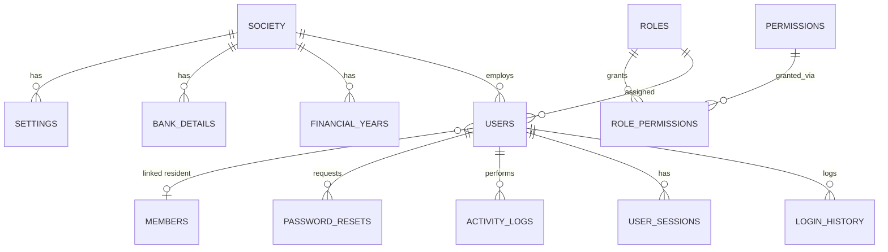
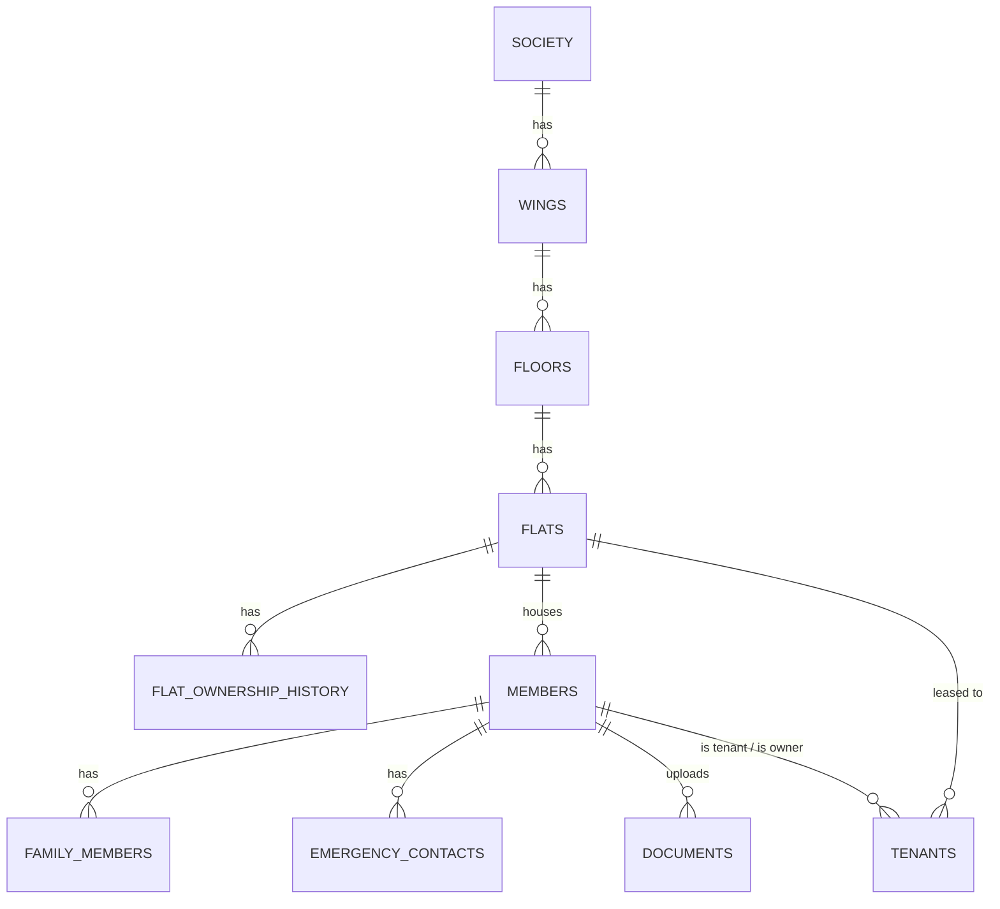
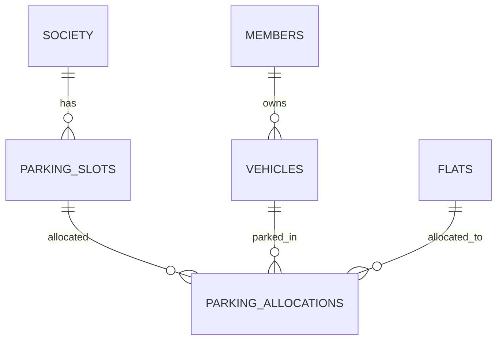
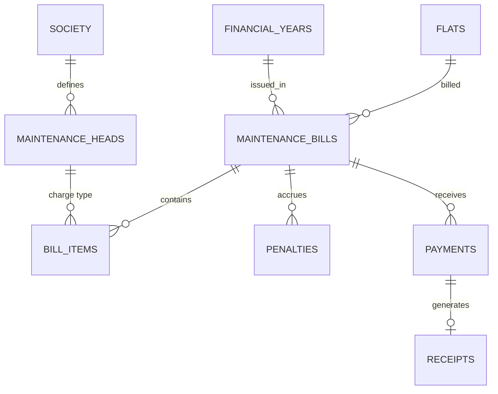
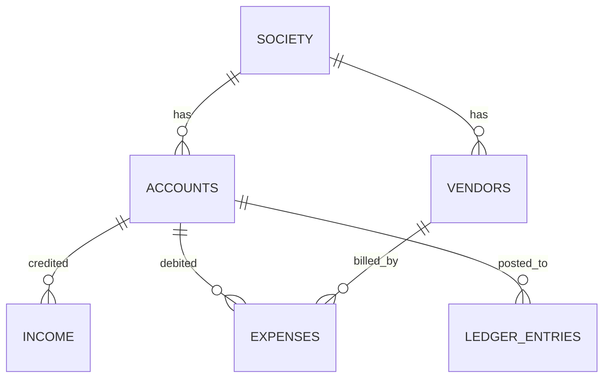
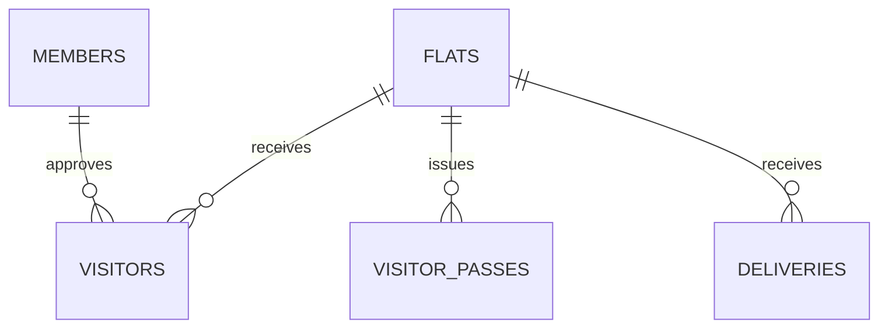
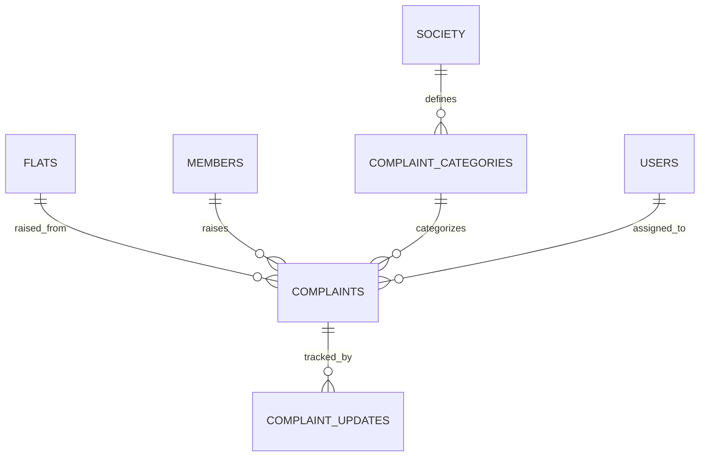
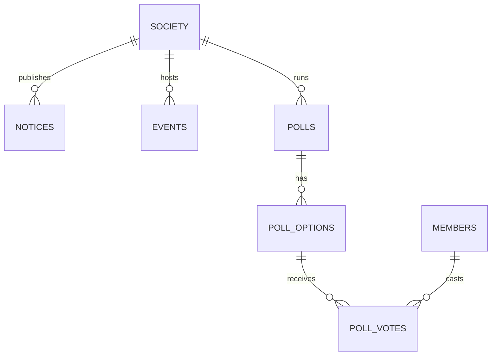
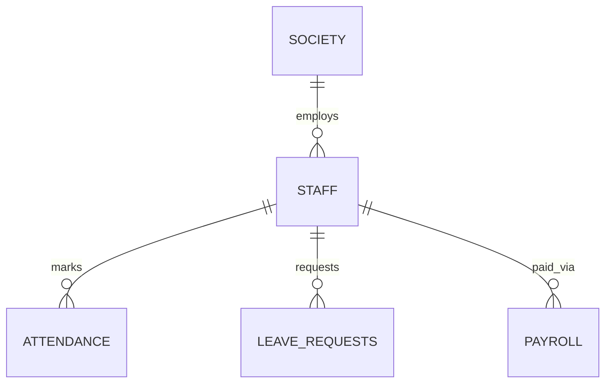
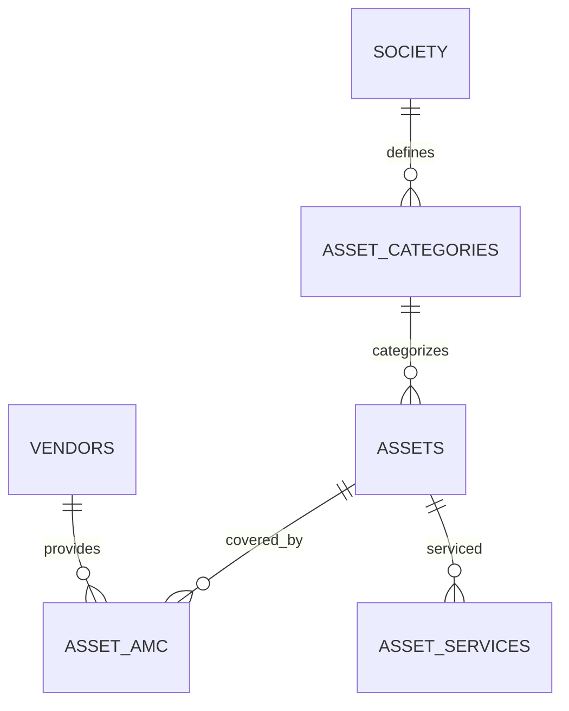

# SocietyOS — Entity Relationship Diagram

Full schema: [`database/schema.sql`](../database/schema.sql) (41 module tables + 13 admin/security tables = 54 total).
Diagrams are split by domain for readability — cross-domain FKs (e.g. `flat_id` used everywhere) are noted under each diagram.

## Administration & RBAC

## Society Structure → Residents

## Vehicles & Parking

## Maintenance Billing

## Accounting

*`ledger_entries.reference_id` polymorphically points to `income`, `expenses`, or `payments` per `reference_type` — no FK constraint, resolved in application code.*

## Visitors & Security

## Complaints

## Communication

## Staff

## Assets

## Cross-cutting notes

- Every module table carries `society_id` even though this is a single-society install — kept for referential integrity and to make a future multi-society migration additive, not a rewrite (not built now; YAGNI applies today).
- `flats.id` is the hub — members, vehicles (indirectly), bills, visitors, complaints, deliveries, and parking all key off it.
- All FKs use `ON DELETE CASCADE` for true child records, `ON DELETE SET NULL` for optional actor references (e.g. `logged_by`, `assigned_to`).
